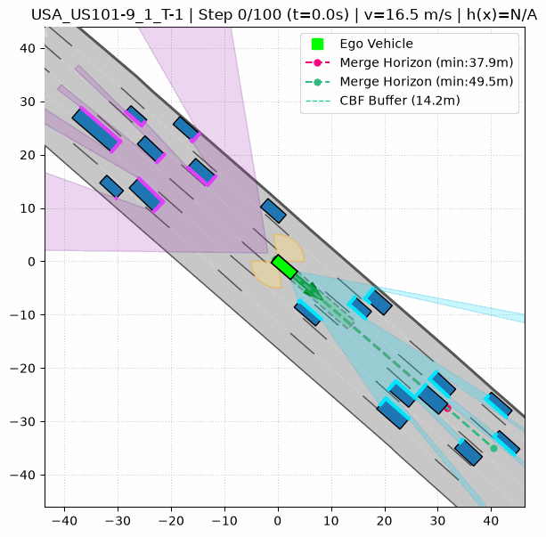
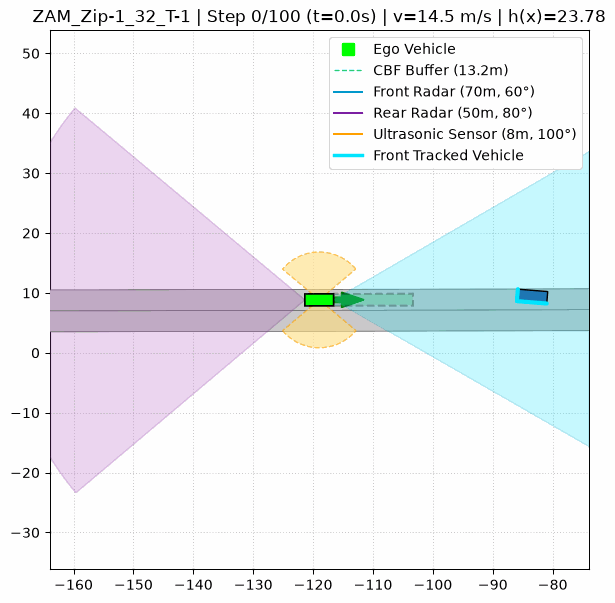

# CommonRoad CBF

A modular autonomous-driving simulation framework built on [CommonRoad](https://commonroad.in.tum.de/), combining simulated perception, behavior planning, and safety-critical control in a closed-loop environment.

The project currently brings together **radar and ultrasonic sensing, behavior planning, and safety-critical control**, with the components designed to be developed and evaluated independently.

The longer-term goal is to use this as a foundation for studying how **uncertainty and imperfections in perception affect downstream planning, control, and safety**.

----------

## Overview

The system follows a modular perception-to-control pipeline:

```text
                 CommonRoad Scenario
                         │
                         ▼
                    Perception
                         │
                         ▼
                 Behavior Planning
                         │
                         ▼
               Safety-Critical Control
                         │
                         ▼
                    Simulation

```

The components are kept relatively independent, making it possible to modify individual parts of the stack without redesigning the entire system.

----------

## Demonstrations

The simulations below show the current system operating on CommonRoad scenarios.

### USA US-101

Highway driving with perception, behavior planning, lane changes, and safety-critical longitudinal control.



### ZAM Zip-Merge

Merging behavior with trajectory tracking and longitudinal safety control.



----------

## Current Implementation

### Perception

The perception layer currently includes simulated **radar and ultrasonic sensors** for detecting surrounding obstacles.

The sensor layer is separated from the rest of the stack so that different sensing assumptions can be introduced without changing the downstream planning and control logic.

### Behavior Planning

A finite-state behavior planner handles high-level driving behavior, including lane keeping, gap search, and lane changes.

### Safety-Critical Control

Longitudinal control uses a **Control Barrier Function (CBF) formulated as a Quadratic Program**, providing a safety constraint alongside the desired driving behavior.

Lateral trajectory tracking uses a **Stanley controller**.

----------

## Installation & Running

Clone the repository and install the required dependencies:

```bash
git clone https://github.com/shreyas-ad-dev/commonroad_cbf.git
cd commonroad_cbf

python -m venv venv
source venv/bin/activate

pip install --upgrade pip
pip install -r requirements.txt

```

Run a scenario:

```bash
python run_scripts/usa.py

```

or:

```bash
python run_scripts/zam32.py

```

The simulations generate animated visualisations of the resulting behavior.

----------

## Future Work

This repository is being developed as a foundation for studying **perception uncertainty in autonomous driving**.

Upcoming roadmap stages include:

-   **Sensor Suite & Object Tracking:** Developing a unified perception interface with state estimation and filtering.
-   **Realistic Noise Models:** Introducing measurement noise, missed detections, and false positives.
-   **Latency & Update Rates:** Simulating sensor processing delays and asynchronous sensor updates.
-   **Uncertainty Propagation Analysis:** Evaluating how perception degradation affects downstream planning and CBF safety margins.

The research question guiding this framework is:

> **How much can perception degrade before the behavior and safety of the overall system begin to fail?**

----------

## Project Status

**Active Development**

Current focus is on abstracting the perception layer into a unified `SensorSuite`, developing object tracking, and refining map-topology awareness.

----------

## References

-   [CommonRoad](https://commonroad.in.tum.de/)
-   Ames et al., _Control Barrier Function based Quadratic Programs for Safety Critical Systems_
-   Notomista et al., _Enhancing Game-Theoretic Autonomous Car Racing Using Control Barrier Functions_

