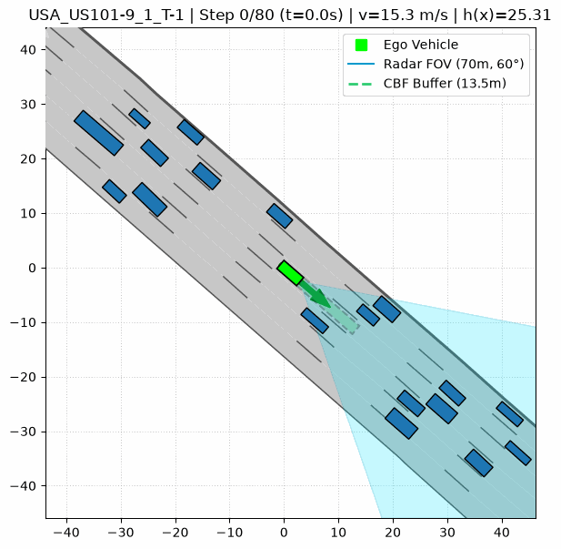
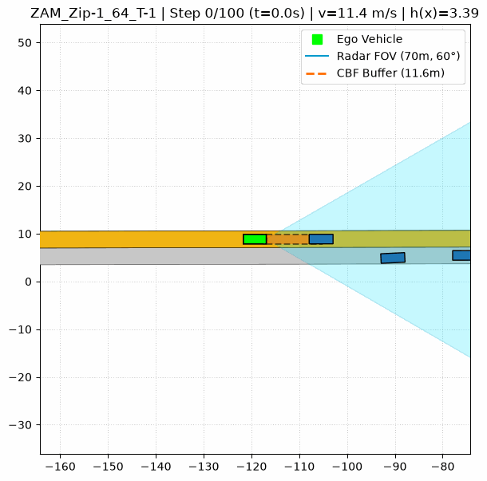

# CommonRoad CBF — Autonomous Vehicle Control & Simulation

A CommonRoad-based autonomous driving simulation framework providing a foundation for experimenting with **vehicle dynamics, perception, behaviour planning, and safety-critical control**.

The repository currently provides a nominal closed-loop baseline using radar-based perception, a finite-state behaviour planner, Control Barrier Function (CBF) based longitudinal control, Stanley lateral control, and a kinematic bicycle vehicle model.

The project is intended as a **foundation for subsequent research experiments** involving imperfect perception, uncertainty, prediction, and safety-critical autonomous driving.

---

## Overview

The system operates as a closed-loop autonomous driving stack:

```text
                 CommonRoad Scenario
                         │
                         ▼
                  ┌─────────────┐
                  │  Perception │
                  │    Radar    │
                  └──────┬──────┘
                         │
                         ▼
                  ┌─────────────┐
                  │  Behaviour  │
                  │   Planner   │
                  └──────┬──────┘
                         │
                         ▼
                ┌─────────────────┐
                │ Safety-Critical │
                │     Control     │
                │                 │
                │   CBF-QP +      │
                │    Stanley      │
                └───────┬─────────┘
                        │
                        ▼
                ┌──────────────────┐
                │ Vehicle Dynamics │
                │ Kinematic Bicycle│
                └───────┬──────────┘
                        │
                        ▼
                  Updated State
                        │
                        └──────────► Next Simulation Step
```

The separation between perception, planning, control, and vehicle dynamics is intentional. It allows individual components to be modified and evaluated independently in future experiments.

---

## Current Capabilities

### Perception

The current perception module provides a simplified forward-facing radar model.

* Configurable radar field of view and range
* Transformation of detected obstacles into the ego-vehicle frame
* Dynamic obstacle filtering
* Lead-vehicle identification within the current driving corridor

**Implementation:** `src/radar.py`

### Behaviour Planning

A finite-state behaviour planner handles high-level driving behaviour.

Current states include:

* `LANE_KEEP`
* `GAP_SEARCH`
* `LANE_CHANGE`

The planner uses CommonRoad lanelet information to identify and construct reference trajectories for the vehicle.

**Implementation:** `src/behavior_planner.py`

### Longitudinal Control

Longitudinal safety is handled using a Control Barrier Function formulated as a Quadratic Program.

The current baseline uses a dynamic safety-distance formulation:

$$
h(x) = \Delta x - (d_{\min} + v_{\text{ego}}\tau)
$$

The controller attempts to maintain the safety constraint while tracking a desired cruising velocity.

The implementation includes both:

* CBF-QP optimisation using CVXPY
* Analytical fallback

**Implementation:** `src/cbf_solver.py`

### Lateral Control

Lateral trajectory tracking is performed using the Stanley controller.

The controller uses:

* cross-track error
* heading error
* vehicle velocity

to determine the steering command.

**Implementation:** `src/lateral_controller.py`

### Vehicle Dynamics

The vehicle is propagated using a kinematic bicycle model.

The current state representation includes:

* longitudinal position
* lateral position
* heading
* velocity

Vehicle geometry is also used for collision detection.

**Implementation:** `src/vehicle_dynamics.py`

### Simulation & Visualisation

The system executes the complete stack in a closed loop and generates animated GIFs showing the vehicle and surrounding traffic.

**Implementation:** `src/visualizer.py`

---

## Demonstrations

### USA US-101 — Highway Scenario

The USA scenario demonstrates highway driving with gap search, lane selection and lane-change behaviour while maintaining longitudinal safety.



### ZAM Zip-Merge Scenario

The ZAM scenario demonstrates trajectory following and longitudinal safety control in a merging environment.



These scenarios represent the **nominal baseline** of the system. Future experiments will introduce increasingly realistic sources of uncertainty into the perception and control pipeline.

---

## Repository Structure

```text
commonroad_cbf/
│
├── scenarios/
│   ├── USA_US101-9_1_T-1.xml
│   ├── ZAM_Zip-1_32_I-1-1.xml
│   └── ZAM_Zip-1_64_T-1.xml
│
├── src/
│   ├── behavior_planner.py
│   ├── cbf_solver.py
│   ├── lateral_controller.py
│   ├── radar.py
│   ├── scenario_loader.py
│   ├── utils.py
│   ├── vehicle_dynamics.py
│   └── visualizer.py
│
├── run_usa.py
├── run_zam.py
├── requirements.txt
└── README.md
```

---

## Installation

### Prerequisites

* Python 3.9+
* `pip`
* CommonRoad-compatible Python environment

### Clone the repository

```bash
git clone https://github.com/shreyas-ad-dev/commonroad_cbf.git
cd commonroad_cbf
```

### Create a virtual environment

#### Linux / macOS

```bash
python3 -m venv venv
source venv/bin/activate
```

#### Windows

```powershell
python -m venv venv
.\venv\Scripts\Activate.ps1
```

### Install dependencies

```bash
pip install --upgrade pip
pip install -r requirements.txt
```

---

## Running the Simulations

Run the scenarios from the project root.

### USA US-101

```bash
python run_usa.py
```

The simulation generates:

```text
usa_us101_radar_cbf.gif
```

### ZAM Zip-Merge

```bash
python run_zam.py
```

The simulation generates:

```text
zam_zip_radar_cbf.gif
```

---

## Baseline Architecture

The current implementation intentionally uses relatively simple and interpretable components:

| Layer                | Current implementation |
| -------------------- | ---------------------- |
| Scenario             | CommonRoad             |
| Perception           | Simplified radar model |
| Behaviour            | Finite-state planner   |
| Longitudinal control | CBF-QP                 |
| Lateral control      | Stanley controller     |
| Vehicle model        | Kinematic bicycle      |
| Collision model      | Polygon-based geometry |
| Visualisation        | Animated simulation    |

This provides a controlled baseline from which individual components can be replaced or extended.

---

## Current Limitations

The current system is a **simulation baseline**, rather than a complete autonomous driving stack.

Important simplifications include:

* Perception currently operates on simulated scenario information rather than raw sensor data.
* Sensor noise and measurement uncertainty are not currently modelled.
* Sensor latency and missed detections are not currently modelled.
* The vehicle is represented using a kinematic rather than dynamic model.
* The behaviour planner is deliberately simplified.
* The current controller assumes access to sufficiently accurate state estimates.
* The number of evaluated scenarios is currently limited.

These limitations are intentional and provide controlled starting points for future experiments.

---

## Research Direction

The repository is intended to serve as a **foundation for experiments in autonomous driving under imperfect and uncertain perception**.

Possible extensions include:

* sensor measurement noise
* state-estimation and filtering
* sensor latency
* missed or erroneous detections
* uncertainty-aware safety control
* dynamic vehicle models
* prediction of surrounding agents
* vulnerable road-user interaction
* motion planning under uncertainty

Experimental investigations are intended to build on this baseline rather than modify the foundation unnecessarily.

---

## Design Philosophy

The project follows three principles:

### 1. Modular

Perception, behaviour planning, control, and vehicle dynamics are separated so that individual components can be replaced or extended.

### 2. Reproducible

Experiments should be executable against fixed CommonRoad scenarios with clearly defined parameters and evaluation metrics.

### 3. Extensible

The baseline is deliberately kept simple so that future experiments can isolate the effect of individual changes.

---

## Status

**Current status: Foundation / Baseline**

The nominal closed-loop system is operational on selected CommonRoad scenarios.

The next stage of development focuses on understanding how the baseline behaves when the assumptions about perfect or sufficiently accurate perception are relaxed.

---

## References

* Notomista, G. Wang, M. Schwager, M. & Egerstedt, M. — *Enhancing Game-Theoretic Autonomous Car Racing Using Control Barrier Functions*, ICRA 2020
* Ames, A. D. et al. — *Control Barrier Function based Quadratic Programs for Safety Critical Systems*
* [CommonRoad](https://commonroad.in.tum.de/)
* [CommonRoad Documentation](https://commonroad.in.tum.de/docs/)

---

## Author

**Shreyas Rajagopal**

This project is part of an ongoing exploration of autonomous driving, safety-critical control, perception, and motion planning.

