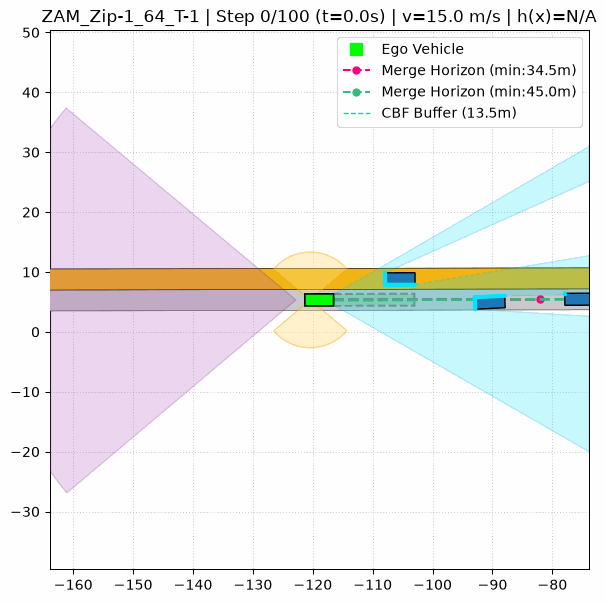

# CommonRoad CBF

A closed-loop modular autonomous-driving simulation framework built on [CommonRoad](https://commonroad.in.tum.de/) for experimenting with the interaction between **perception, tracking, behavior planning, vehicle dynamics, and safety-critical control**.

The repository is intended as a reusable base for autonomous-driving research experiments. The current implementation uses a CBF-based longitudinal safety controller. The architecture separates perception, planning, control, and vehicle dynamics so that the control algorithm can be replaced in future experiments.

A longer-term research direction is to study **motion planning and decision making under perception uncertainty**, including noisy sensor measurements, missed detections, tracking uncertainty, vulnerable road users (VRUs), and edge-case scenarios.

--- 


## Overview

The current closed-loop simulation follows this pipeline:
```text 
				 CommonRoad Scenario 
						│ 
						▼ 
					Perception 
						│ 
						▼ 
				Behavior Planning 
						│ 
						▼ 
				Safety-Critical Control
						│ 
						▼ 
					Simulation 
  ```

The components are kept relatively independent, making it possible to modify individual parts of the stack without redesigning the entire system.

---
  

## Demonstrations

The simulations below show the current system operating on CommonRoad scenarios.
  

### USA US-101

Highway driving with perception, behavior planning, lane changes, and safety-critical longitudinal control.
  


### ZAM Zip-Merge

  
Merging behavior with trajectory tracking and longitudinal safety control.




  
---  


## Current Implementation

### Scenario and Map

The simulation uses CommonRoad scenarios and planning problems as the environment. `MapModule` provides the map-related functionality required by the simulation. Route extraction follows the CommonRoad lanelet topology and falls back to a successor chain when a goal-directed route cannot be found.

  
### Perception
  
The perception layer provides configurable simulated sensing with front/rear radar and left/right ultrasonic sensors (USS). Sensor combinations, range, and FOV can be configured independently. A high-fidelity geometric occlusion model accounts for occluded regions and partial object visibility within each sensor's effective sensing region. Sensor coverage and occlusion are visualized directly in the simulation.


### Multi-Object Tracking

Sensor detections are passed through a shared multi-object tracking pipeline using **Hungarian association**, spatial gating, and **2D constant-velocity Kalman filters**. Tracks transition between tentative, confirmed, and deleted states, with prediction maintained across missed detections. Configurable confirmation and track-age thresholds control track lifecycle. The resulting filtered object positions and velocities are provided to the behavior planner and longitudinal controller.


### Behavior Planning
  
A finite-state behavior planner handles high-level driving behavior, including lane keeping, gap search, and lane changes.  

  
### Safety-Critical Control

Longitudinal control uses a **Control Barrier Function (CBF) formulated as a Quadratic Program**, providing a safety constraint alongside the desired driving behavior. Lateral trajectory tracking uses a **Stanley controller**.


### Vehicle Dynamics

The ego vehicle is represented by an `EgoState` model capturing its position, heading, longitudinal velocity, vehicle dimensions, wheelbase, and road-frame vectors. State propagation uses a **kinematic bicycle model**, with longitudinal acceleration and front-wheel steering as the control inputs. This provides the vehicle dynamics layer connecting the controller outputs to the evolving simulation state.

---  


## Logging and Visualization

Simulation data is recorded at each step in a JSONL log, capturing the ego state and relevant planning and control information for later analysis. The dashboard uses the logged data alongside the generated GIF to visualize simulation state and relevant signals synchronously.

---
  

## Installation

The simulation environment currently uses **Python 3.14**.

Clone the repository:

```bash

git clone https://github.com/shreyas-ad-dev/commonroad_cbf.git

cd commonroad_cbf

```

Create and activate the simulation virtual environment:  

```bash

python3.14 -m venv venv

source venv/bin/activate

```

Upgrade `pip` and install the simulation dependencies:
  

```bash

pip install --upgrade pip

pip install -r requirements.txt

```
---


## Run a scenario

```bash

python run_scripts/usa.py

```

The `run_scripts/` directory contains additional scenario test cases.

---


## Dashboard

The repository also contains a separate Streamlit dashboard for inspecting the simulation logs and replaying the generated GIF frame-by-frame.

The dashboard environment uses **Python 3.12** and should be kept separate from the Python 3.14 simulation environment.

### Create the dashboard environment

From the repository root:

```bash

python3.12 -m venv dashboard_venv

source dashboard_venv/bin/activate

```
Install the dashboard dependencies:

```bash

pip install --upgrade pip

pip install -r dashboard_requirements.txt

```

### Launch the dashboard 

Make sure the generated `.jsonl` and `.gif` files are in the repository root, then run:

```bash

streamlit run app.py

```

The dashboard scans the current directory for JSON/JSONL logs and GIF files, so launch it from the repository root where the simulation outputs are located.  

---
  

## Research Direction

The framework is designed to investigate how sensor measurement noise, missed detections, false positives, and tracking uncertainty affect behavior planning and safety decisions. It also provides a common platform for comparing different planning and control algorithms under the same perception conditions, including challenging edge cases involving vulnerable road users.

---
  

## References

- [CommonRoad](https://commonroad.in.tum.de/)

- Ames et al., *Control Barrier Function based Quadratic Programs for Safety Critical Systems*

- Notomista et al., *Enhancing Game-Theoretic Autonomous Car Racing Using Control Barrier Functions*

